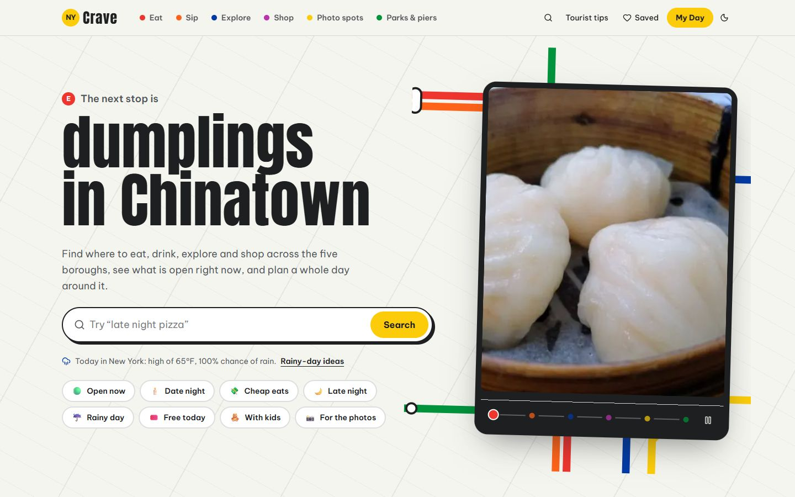
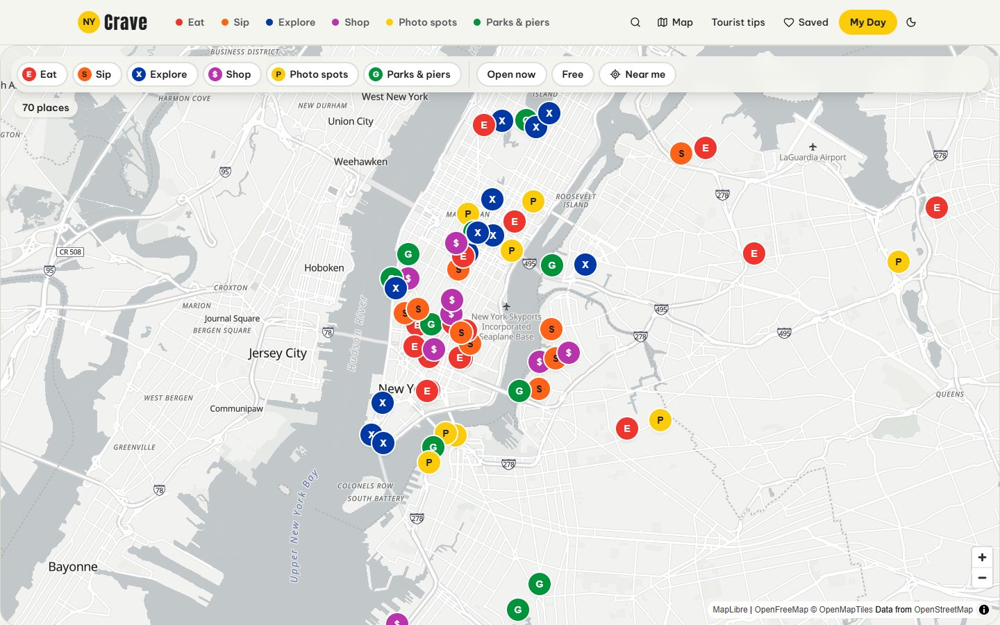
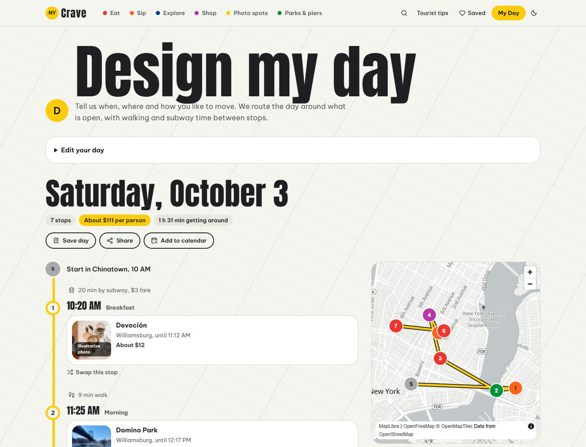
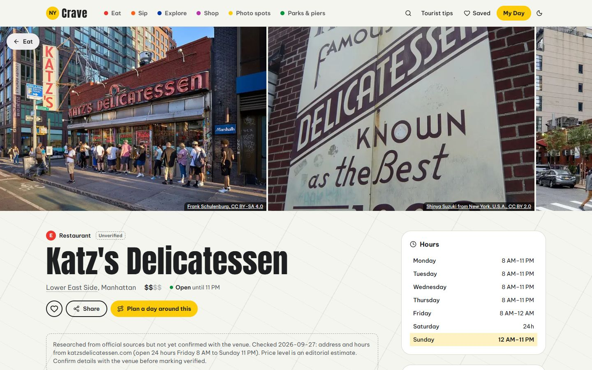
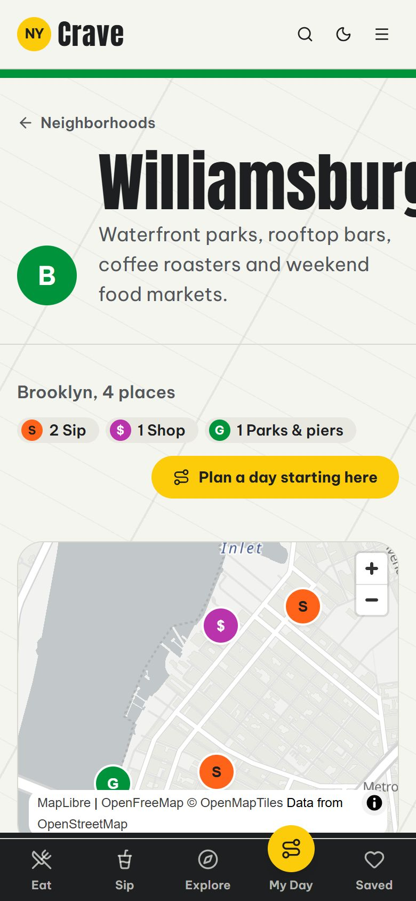
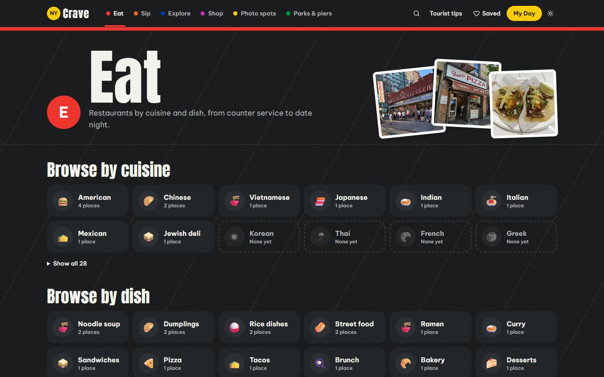

# NYCrave

**New York, one craving at a time.** NYCrave is a mobile-first guide to New York City for locals and visitors: where to eat, what to sip, what to see, where to shop, where to take the photo, and which park to end the day in, plus a planner that builds a whole day around what is actually open.



## Why NYCrave

New York has more good places than anyone can keep track of, and most guides fall short in the same ways: long lists with no sense of geography, no idea whether a place is open right now, and no help turning "things I want to try" into a day that actually works.

NYCrave is built around three goals:

1. **Answer the real question: "where should I go right now?"** Every place shows live open or closed status in New York time, including late-night hours that run past midnight.
2. **Plan days, not just lists.** Design My Day turns a mood, a budget and a starting point into a timed route with walking and subway estimates.
3. **Be honest.** Places are checked against official sources and say when they were checked; photos are properly licensed and credited; nothing is scraped from review sites.

## Features

### Browse the city by line

Each of the six sections rides its own subway line color:

| Line | Section | What you'll find |
| --- | --- | --- |
| 🔴 E | **Eat** | Restaurants by cuisine and by dish: dumplings, pho, pizza, ramen, tacos and more |
| 🟠 S | **Sip** | Coffee, tea, matcha, bubble tea, cocktail bars and rooftops |
| 🔵 X | **Explore** | Museums and landmarks with ticket prices, time needed and the best time to go |
| 🟣 $ | **Shop** | Flagships, vintage and thrift, bookstores and markets |
| 🟡 P | **Photo spots** | Exact coordinates, the best light (sunrise, golden hour, blue hour) and framing tips |
| 🟢 G | **Parks & piers** | Activities, amenities and seasonal notes |

Every section has filters that live in the link, so any view can be shared: open now, free, borough, neighborhood, price, vibe, dietary needs and best light. Switch between a list and a map, and sort by trending, name or price.

### Find the right place fast

- **Smart search** understands plain phrases like "dumplings in Chinatown", "late night pizza", "free things to do" or "vegan boba", and suggests places by name as you type.
- **Mood chips** for date night, cheap eats, late night, rainy days, kids and photos.


- **The city map** puts every place on one map: toggle lines, show only what's open now or free, tap *Near me* to fly to where you are, and tap a marker for a preview card.
- **Near me** sorts any list by distance and shows the walk or subway time to each place.
- **Surprise me** jumps to a random place that is open right now.
- **Today's weather** on the home page, with rainy-day ideas when rain is likely.

### Ask NYCrave

A chat assistant, on every page, for questions like *"Where can I get dumplings in Chinatown?"*, *"What's open late in the East Village tonight?"*, *"Plan a rainy Saturday in Manhattan"* or *"How do I get from JFK to Midtown?"*. It answers in English or Vietnamese and shows cards for the places it suggests.

The assistant is powered by Claude, but it does not guess: it looks everything up with NYCrave's own tools (search, live opening hours, place details, nearest subway, the day planner and the tourist tips), recommends only places that are on NYCrave, and links each one. It never invents hours, prices or reviews, and it reminds you to check hours before you go.

### Design My Day



Pick a date, start and end times, a starting neighborhood, a budget, a mood (first time in NYC, foodie, romantic, chill, adventurous or artsy), interests, dietary needs and a pace. NYCrave builds the day from breakfast to a nightcap:

- every stop is **open for the whole visit**, including places that close after midnight;
- the route stays **close together**, with walking or subway time and fares between stops;
- the **total cost** stays within your budget;
- with **weather** turned on, a rainy forecast moves indoor stops to the front.

Every subway hop names the stations at each end, and the train to take when one runs straight there that day (no B or W on weekends). Not sure where to start? Six **ready-made days** (a classic first day, a food crawl, Brooklyn by the water, art and museums, date night, and a $50 day) are planned fresh for today with one tap.

Then **swap** any stop you don't like, **save** the day, **share** a link that rebuilds exactly the same plan, **add it to your calendar**, or **open the whole route in Google Maps** with every stop as a waypoint. From any place page, **Plan a day around this** builds a day that includes that place at the best time for it. An optional **Refine with AI** step lets Claude re-pick stops, but only from places on NYCrave, and every pick is checked again against hours and budget.

### Place pages



A photo gallery with credits, a live "open until 11 PM" badge, the week's hours, must-try items, our own take, tickets and time needed, the **nearest subway stations** with their train bullets and walking time, one-tap directions (Google Maps, Apple Maps or transit), similar places nearby, and save and share buttons. Photo spots add exact coordinates and **today's sunrise, golden hours, sunset and blue hour**, calculated for that spot.

### Neighborhood guides and tourist tips



- **34 neighborhood guides** across all five boroughs, each with an introduction, the subway lines that serve it, a map of its places, nearby neighborhoods and a *Plan a day starting here* button.
- **Tourist tips**: getting in from JFK, LaGuardia and Newark; OMNY and the subway; tipping and sales tax, with a calculator that shows what dinner really costs per person; safety and etiquette; and the city through the seasons.

### Works like an app

- **Installable** on iPhone and Android. Saved places stay available offline, even underground.
- **Saved** places and saved days live on your device; no account needed. **Share your list** as a link, and whoever opens it can save every place with one tap.
- **In English and Vietnamese (Tiếng Việt)**: switch in the footer; place descriptions are in English for now.
- **Light and dark mode**, keyboard navigation, screen-reader labels and reduced-motion support throughout.

<br clear="right">

## How to use it

1. **Start on the home page.** Type a craving into the search box, tap a mood chip, or pick a line under *Browse by line*.
2. **Narrow it down.** Turn on *Open now*, pick a borough or a vibe, or tap *Near me*. Switch to *Map* to see where everything is.
3. **Open a place** to see its hours, what to order, how to get there and what else is nearby. Tap the heart to save it.
4. **Plan the day.** Go to *My Day*, set your date, mood and budget, and press *Design my day*. Swap anything you don't like, then share it or add it to your calendar.
5. **On the go,** add NYCrave to your home screen.

## Design

NYCrave looks like a food magazine that fell for the subway map:

- the background is the **Manhattan street grid**, tilted 29 degrees like the real one;
- section headings are **station signs**, and every section is a **subway line bullet** in the real MTA colors;
- the home page poster sits on a fragment of an **octilinear route map**, and the browse strip is a **white subway tile wall**;
- headlines are set in **Anton**, condensed poster type, and text in **Be Vietnam Pro**; both support Vietnamese, which NYCrave now speaks;
- **taxi yellow** is saved for things you can press.



## Data and trust

- **70 real places** across the six sections, each checked against the venue's official website or current listings, with the source and date recorded. Places carry an *Unverified* tag until they are confirmed with the venue, and unverified places are kept out of search engines.
- **Photos** come from Wikimedia Commons under free licenses (CC0, public domain, CC BY and CC BY-SA). Every photo is credited on its place page and on the site's *Photo credits* page. Generic shots of a dish or drink are labeled *Illustrative*.
- **No scraping.** Ratings and reviews only ever come from the official Google Places API, with attribution. The editorial takes are our own writing.
- **Easy to maintain.** An editor page lets you add places, fix details, pull hours from Google and mark places as verified.

## Under the hood

Next.js 16 and TypeScript · Tailwind CSS v4 and shadcn/ui · Motion · next-intl (English and Vietnamese, ready for Spanish, Chinese, Korean and Japanese) · MapLibre with OpenStreetMap tiles · Open-Meteo forecasts · MTA open data for subway stations · astronomical sun times · optional Supabase, Google Places API and Claude · data validated with zod · automated tests covering opening hours, search, filters, the planner and the place data · Lighthouse mobile scores of 100 for accessibility, best practices and SEO.

To run it locally (Node.js 20.9 or later):

```bash
npm install
npm run dev        # http://localhost:3000
```

Everything works without any keys. Optional services switch on through the environment variables listed in [.env.example](.env.example): Supabase for a live database, Google Places for photos and reviews, an Anthropic key for the *Ask NYCrave* assistant and *Refine with AI*, and an admin password for the editor page.

## What's next

- More languages, starting with Spanish, and translated place descriptions
- Accounts, so saved places and days sync across devices
- A companion mobile app built with Expo on the same data model
- More places, especially beyond Manhattan and Brooklyn

---

Photos: see the site's *Photo credits* page for every photographer and license. Map data © OpenStreetMap contributors. NYCrave is an independent project, not affiliated with the MTA or any venue listed.
